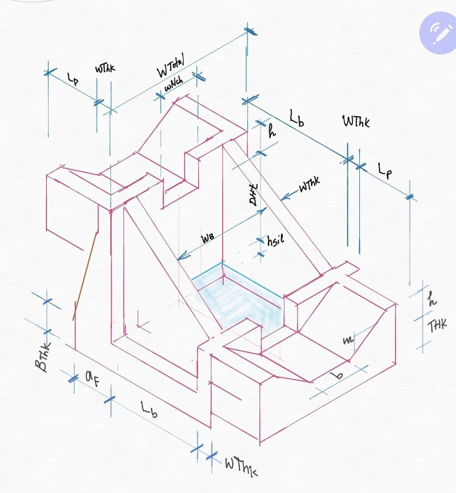
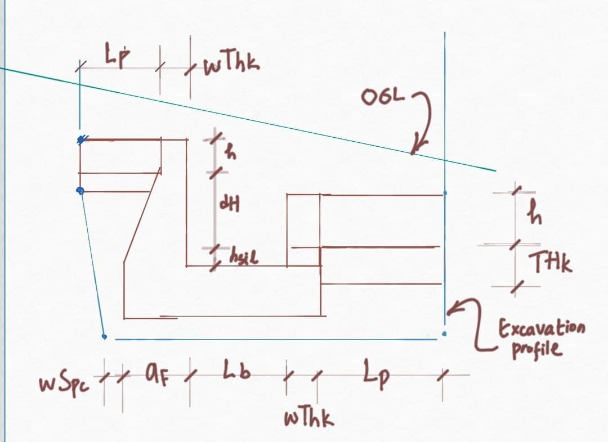
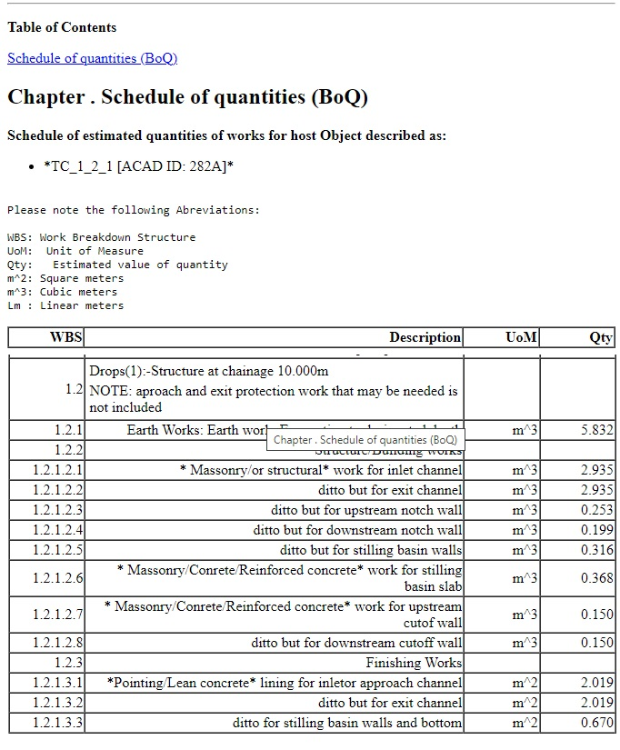

# Design of Drops in CanalNETWORK

CanalNETWORK software can design drop structures using different methods. The software designs drops in two stages:

* Crest Design: dealing with the design of the overflow area before the vertical fall, and the related hydraulic conditions.

* Energy dessipator design: dealing with hydraulic jump conditions after the vertical fall, and the provisions required for safely dessipating the energy.

While the approaches commonly used for crest design are fairly similar, there are a number of established approaches to work out the energy dessipator design. CanalNETWORK currently has the following methods incorporated.

- Straight Drop (USBR)

- Vertical Drops (Guarg)

- Sadra (Glass, Dyas, Ethchevery', UPRI)

- Simple (FAO 24)

- French (ECDSWCo)

- Chows (ECDSWCo)

- Ankun (ECDSWCo)

> The reference sources used in developing the algorithms for each method are indicated in brackets.

This guideline is primarily prepared to guide validation works with in our partners workflow, namely Ethiopian Construction Design and Supervision Works Corporation. In line with this, the discussion on design of energy dessipator focuses only on Chows method. 

## Upstream Crest Design

A rectangular crest is used for drops designed using this method. For this condition, the Top Width of the crest B is given by:

B= 0.55 x d ^(1/2)

where d is the drop size.

The overflow discharge capacity is given by the governing equation:

For Q<14m3/sec

* Q= 1.835 x L x H^(3/2) x (H/B)^(1/6) 

For Q>=14m3/sec

* Q=1.99 x L x H^(3/2) (H/B)^(1/6)

where L is the length of the crest (across the flow direction), and H is the hydraulic head over the crest. See the figure below.

 

*Typical hydraulic conditions over a drop structure.*

*Crests of fall structures and upstream ydraulic conditions*

> Note: For Q>=14m3/sec the guideline recommends the use of a trapezoidal crest for the overflow section, hence the correponding modification in the discharge coeficient in the governing equation above.

Based on the above solutions, the critical flow depth, overflow depth are determined from:

q= Q/B

yc= (q^2/9.801) ^ (1/3)

Ho= 1.5 x yc

This completes the upstream crest design, and establishes the parameters for the design of the energy dessipation provission below.

## Design of Energy Dessipator

The design of energy dessipator provssion in Chows method relies on the Drop Number, calculated from:

D= q^2/(9.801 x h^3

where

h= d + ds, sum of the fall height and depth of sill

![[  ]](Images/Image%20002.png) 

Then, the upstream and downstream flow depth is dtermined from

y1= d x 0.54 D ^0.425

y2= d x 1.66 D^0.27

Based on this, sill depth is determined from

a= max (amin, y2/6)

Post impact length and 'unaided' jump length are determined from

Ld= 4.30 D^0.270 x d

Lj= 5 x (y2-y1)

and

L= Ld + Lj

The width of the basin is determined by providing a fixed amount of 0.10m (aplit on both sides) to provide for aeration.

Wb = Bw+0.10

Finally, the appron thickness is determined from considering the maxium uplift pressure magnitude and a unit weitgh massonry or concrete taken as 2.2;

Tb= (Ho + d + a)/2.2

Nominal downstream and upstream cutoff depths are provided as follows.

du= dd=  0.30

Upstream and downstream protection lengths are provided usinhg

L1= L2 = 1.2 + 1.5 q^(1/2).

> All dimensions for basin length, basin width, appron thickness, and protection length are rounded to 0.05 meters.

A typical output table for drop design data is extracted from `Explore Solutions > Data Tables > Explore Drops` as shown below.

*Typical output of drop design data*

## BoQ calaculation for drops

For the calcualtion of volumes of work for drops, the following procedures are implemented. The starting points are user provided values for Control BoQ Settings in `Workspace > Edit Preferences`. 

*Contents of the Control BoQ Settings variable group*

where:

B/H Ratio (Wall): ratio of height to width to determine the thickness of vertical wall of the drop at foundation level (default 0.65)

Excavation Cut Slope: Slope of vertical excavation from surface to foundation level (default 0.25)

Working space: desired space to maintain for working space, set by default to 0.30m

Compacted fill Ht: Height of compacted back filll material required on excavated bottom, and below the foundation block.

The calculation of quantities is carried out based on the following schematic diagrams:

*Isometric view of a drop structure as used for estimation of quantities in CanalNETWORK product.*

*Section view of a drop structure for quantity estimation.*

Where:

WThk is  the crest thickness, or the lininj thickness(Thk) of the canal, which ever is maxisum

aF= ()dHt + hSil) x b2h

Then:

wTotal= 2*(WThk + mxh)+b

Wb= b+2xmxh + 2xThk or Wb+2xWThk, which ever is maximum

The structural volumes are estimated for:

- the approach or inlet canal at upstream end

- the exit canal

- upstream, and downstream notch wall(s)

- The stilling basin, which also consists the foundation slab and the stilling basin walls,

- for upstream and downstream cutoff walls, as a function of WThk and WTotal.

Lining work quantity is also included for inlet and exit canals.

A sample BoQ for a drop structure contains the below informaiton in the standard report for the same.

END.

Reference: A Guide for Irrigation and Drainage Canal Structures Design - Drop Structures, Water Works Design and Supervission Entrepreise, Irrigation Drainage Land Reclamation and Flood Protection Design Team, May 2015, Addis Ababa.
