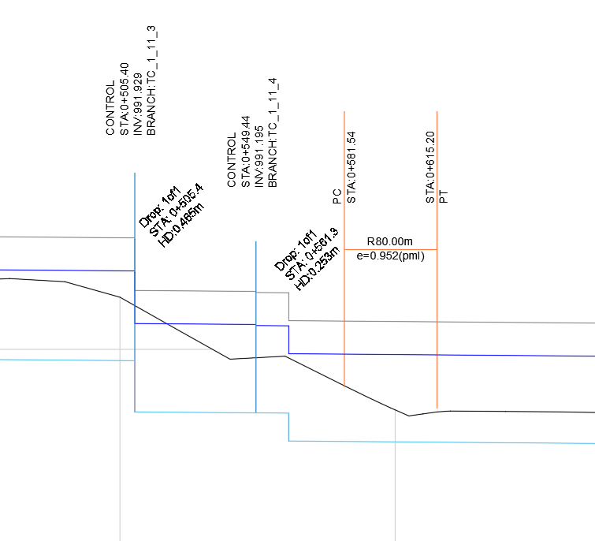
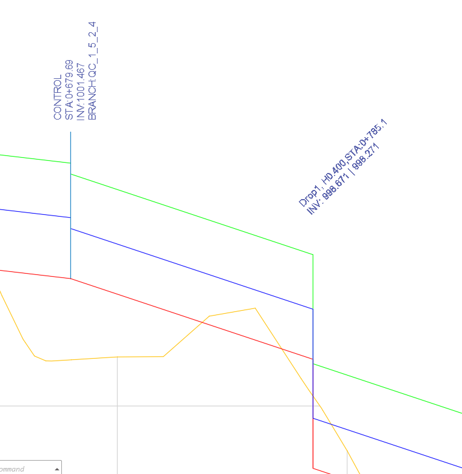

# Update Jan-Apr22

Hi Everyone,

We are pleased to bring to you many enhanced features and functionalities to our products, based on UX feedbacks we have recieved over the past few months. The update in this period, includes - among others - the following key features:

- ability to define any number of drops at desired locations manually
- Improved flexibility and accuracy of BoQ listing for eacth works, allowing to consider structures and clearing depth
- Improved drop insertion and addition in small length canal segments.

## Download files:

Alwats make sure you are working with the updated versions of our products. To update your software to the recent version, down load these resources and follow the usual procedure.

*Note: The download links will take you to a goole drive link. Go to the top right of the page, and choose download to get the files.*

* [Download iCAD 2.2.8.7515d](https://drive.google.com/file/d/1-hoHovaHDI-8wZDq7xhBARPRPMZL_Bqx/view?usp=sharing)

* [Download iCAD bridge 4.4.4](https://drive.google.com/file/d/1LX2mwWGFLmVjbJnTV4gbGgwhonddMcQx/view?usp=sharing)

* [Donaload CanalNetwork 1.5.2.1250i](https://drive.google.com/file/d/1IcH5K-DX1Lr-prM4xD7tB1nDHJZADcw2/view?usp=sharing)

> NEW UPDATES: CanalNETWORK (i) above is improved as follows:
> * Reload ALignment features are supporessed temporarily, to maintain compatibility with iCAD's enhanced profile extraction algorithm.
> * Improved accuracy for BoQ listing, to account for structures and clearing works in reported earth cut and fill works
> * Ability to specify drops at desired stations and heights for any segment.

> For more information on the updated features and how to use them, refer to the online documentation.

> Previous Updates(Mar22): CanalNETWORK(f) above is improved for the following reporeted issues on 20TH FEB 2022
> * iCAD(d) Improved CanalStructures module funcitonality for Q>-0.10m3/sec, plan view generation with description and lateral exageration
> * CanalNETWORK (h) Experimental feature to defunct CBL force to Fit-for-no-drop.
> * Enhanced division box design capability for Q<=0.08m3/sec, and bug fixes on BoQ
>
> Older Updates (15th Feb) updates included below fixes:
> * CanalNETWORK(f): Buf fix on cummulating error while reporting BoQ for canal reach cut volume; Tunrout BoQ details
> * CanalNETWORK(e): Bug-fix for construciton variables (invalid use of Smf values)
> * iCAD(c) Enhancement for Alignmentrofile module for iCAD to correct for curve lengths, and report on skipped curves. iCAD Bridge must be updated for this enhancement to work.

## iCAD Product:

The iCAD product is modified for the following features:

* Fixed error for surface flow calculation in TypeII desipating mechanisms (in CanalStructuresJET module)

* Improved Canal Schedule plotting algorithm to identify OGL (xOfst=0.0) line plots and render the appropriate color in the color template of choice.
  
  *Note: This functionality is available for drawing tasks invoked from with in CanalNETWORK. iCAD modules have yet to be improved to make use of the color template introduced in this version.*

* Improved zoom in/out speed, eidting internal functions and integrating to deployed versions. Scroll zoom operation has now a factor of 2.0 on zoom in, and a factor of 0.5 on zoom out; compared to ~1.1 and ~0.9 respectively.

* A major improvement is made to the plan view generating algorithm of CanalStructures module, to allow scaling and rotating plan view drawings to best fit a selected drawing window.
  
  
  
  *Screenshot of plan view generated with option of a drawing window.*

## Canal Network

### User Interaction

- Canacel Network Open operation improved with a time lag of 1.5 seconds (useful for large data files).

- Progress bar introduced for data opening operation, helpful while dealing with large size files.

- Short cut to frequent tasks including:
  
  - Ctrl + D for AutoDesign function (`Workflow > Design and Analysis > AutoDesign`), 
  
  - Ctrl + E for Direct access of Design criteria for selected route (`Workspace > Manage Design Criteria > Set/Edit Design Criteria`), and 
  
  - Ctrl + 1, Ctrl + 2 and Ctrl _ 3 for display of anootation information for Drop Heights, FSL-OGL, and LSEC detail information

- Included use of Left and Right arrow keys to navigate between successive nodes in profile view axis.

### Functions

- A new prefernce setting is introduced, where a user can force construction dimensions in the design of canal sections and drop heights. A value >=0.05 causes:
  
  - bottom width of all canal sections designed will be rounded to the provided value
  
  - bottom width of all canal sections designed will have a minimum of 0.30m width
  
  - Drop heights provided will be rounded to construction dimensions, per prefered increment heights specified in CBL_designSettings parameter set. 

- Maximum unsupervised drop generation increased to 50, and a dialog informs the user how many drops are expected, saving time for unwanted operations.

- Lsec details can now be generated by the user using Ctrl + 3 or Explore Solutions > Annotators > LSec Details

- The LSec details information is improved to indicate Curvature radius and, if applicable canal bed eccentricity information, along with other information.
  
  Note: Flowsec information is removed on LSEC detail information to reduce redundancy in generated data.

- Batch LSec drawing generation is developed and integrated. Accesible from `Explore Solutions > Batch Process > LSec Plot to AutoCAD`, this function allows generation of LSec drawings to AutoCAD for mulitple canals in a single process, allowing creation of uniformly scaled and annotated drawings.
  
  *Note: The algorithm sorts the selected canals according to generated Tag information, and created drawings in ascending order.*
  
  *Note: The tool is best suited for generation of LSec drawings for canals of similar levels or generation. Otherwise, the vertical scalling may not work out to common presentation standards.*

- AutoDesign function is improved significantly for the following:
  
  - Consider FSL between succesive segments, and automatically apply correction when necessary.
  
  - AutoCorrect provided drop heights to construction dimensions, using the parameters specified in the design criteria. (Note variable drop height inputs are expected for this operation to work succesfully.)
  
  - The tool can now work on either (a) a single segment, if the control downstream of the segment is selected, (b) on all segments of a single route, if a route is selected on plan view, or (c) on a number of routes at a time, if multiple canal routes are selected in the plan view axis.
    
    *Note: To reset the design to tentative designs generated originally, use Resize, and Refresh while the route is selected.*

- Improved overall design capability - better consideration of ground slope variation.
  
  
  
  *Screenshot for AutoDesign for a sample canal route, using earlier version of the algorithm*
  
  
  
  *Screenshot for design of same canal, with improved algorithm, showing better CBL design closer to to the OGL and with standard size drops that results in better FSL-OGL in downstream controls.*
* Now improved to consider Qmin specification in design criteria, instead of using the calculated capacity for each canal segment. This used to generate and position impractical flow sections where calculated capacities are less than specified Qmin values.

### Productions

- A major imrpovement is integrated in this version, to allow production of drawings to AutoCAD using color templates. Two templates are available in this version, namelu:
  
  - Default: The default color settings used in CanalNETWORK interface (existing)
  
  - ECDSWC: Color specification of Ethiopian Construction Design and Supervision Works Corporation (as of Jan2022).
    
    *Note: The color templates are prepared and integrated based on templates obtained from the client. However, work continues to get full approval by the drafting team.*

- Drop detail inforamtion generated to AutoCAD is modified to provide appropriate position and height details as shown in below screen shot.
  
  
  
  *Screenshot of Drop detail text in previous version.*
  
  
  
  *Screenshot of drop annotatoin text in the current release, showing additional information on Invert levels at inlet and exit of a given drop.*

- Improved algorithm to render end-of-canal controls appropriately, overcoming previous bug that missed these controls in some cases.

### Bug fixes

The following bugs are fixed in this version, providing better overall performance to users.

greater value to users.

- output issues when exploring drops for discharges >15m3/sec

- fixed sum error for cummulating discharge during a resize funciton

- fixed sum error for cummulating farm areas 

- Edited menu item on Canal Editor/Solver from Min Lin to Min Pw

- Adjusted seed function to canal section solver algorithm to accomodate larger discharges

- fixed labeling of branch canals in detail view axis for canal indexs exceeding 9

- fixed subnetwork data creation and view in partly taged networks

- fixed bug while editing nodes, with 'No string accepted' message, expecially after editing canal assembly information.

- fix fit-for-no-drop option which reverted invert levels to -0.5 (out of user control) upon release; adjusted to read and set value from design criteria for the corresponding canal level.

- fixed LSEc generation for canals, that created a schedule of NaN values for range overshot; solved by limiting range specification to acaula available data for the canal route in question.

- AutoDesign now considers Qmin seting in design criteria, for calculated capacitities. 

- corrected minFSL-OGL calaculation algotith for precission

- Apply clipping to detail axis text, limiting text information display only with in the boundaries of the axis.

- Fix unintended multiple selection of controls on profile view axis.
